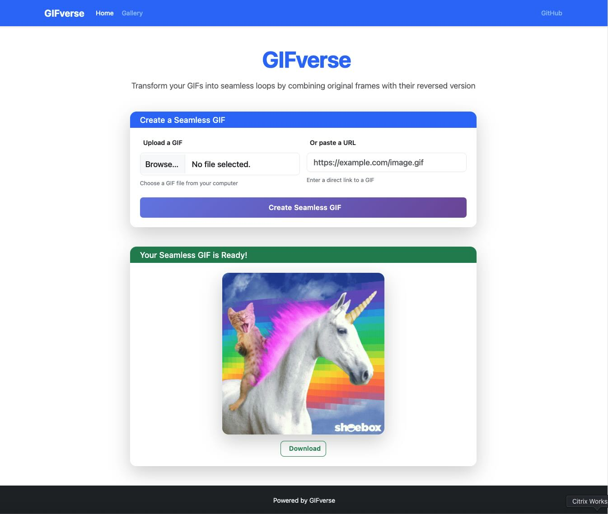
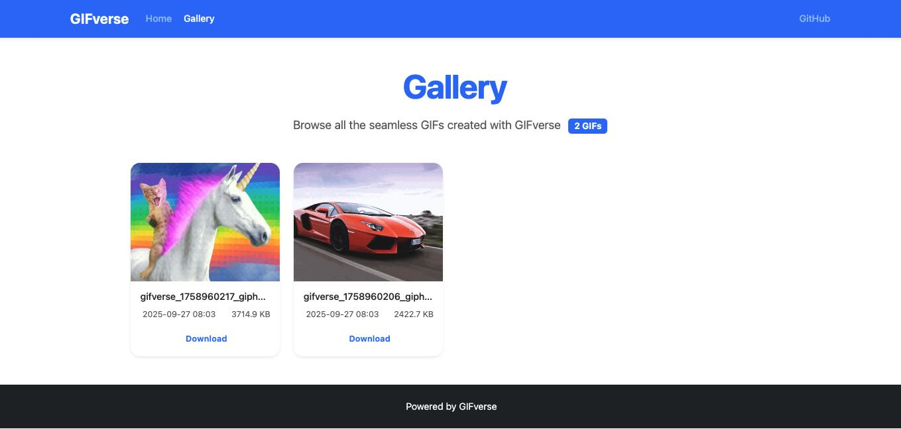
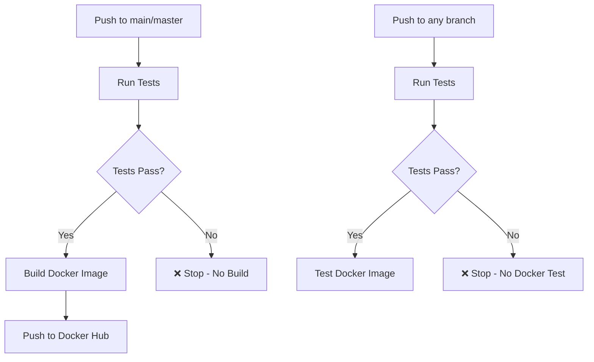

# GIFverse

[](https://github.com/wsams/gifverse/actions)
[](https://github.com/wsams/gifverse/actions)

A Python web application that creates seamless GIF loops by concatenating original GIF frames with their reversed version.

## Screenshots

<div align="center">
  
  
</div>

*Left: Upload a GIF file or provide a URL to create seamless loops | Right: Browse all your created GIFs with pagination and modal preview*

## Features

- **Web Interface**: Modern, responsive web interface with Bootstrap 5
- **Gallery**: Browse all created GIFs with pagination and modal preview
- **Command Line Interface**: Process GIFs directly from the command line
- **Pure Python**: No external shell commands required
- **Frame Processing**: Uses Pillow (PIL) for robust GIF manipulation
- **Error Handling**: Comprehensive error handling and user feedback
- **Modern UI**: Beautiful gradients, animations, and responsive design

## Installation

### Option 1: Docker (Recommended)

#### Using Pre-built Images

Pull and run the latest version:

```bash
docker pull wsams/gifverse:latest
docker run -p 5000:5000 wsams/gifverse:latest
```

Pull a specific version:

```bash
# Pull the latest stable version
docker pull wsams/gifverse:1.0.8
docker run -p 5000:5000 wsams/gifverse:1.0.8

# Pull a major.minor version (gets the latest patch)
docker pull wsams/gifverse:1.0
docker run -p 5000:5000 wsams/gifverse:1.0
```

#### Building from Source

Build and run with Docker:

```bash
docker build -t gifverse .
docker run -p 5000:5000 gifverse
```

Or use Docker Compose:

```bash
docker-compose up --build
```

### Option 2: Local Python Installation

1. Install Python 3.7 or higher
2. Install required dependencies:

```bash
pip install -r requirements.txt
```

## Usage

### Web Interface

1. Start the web server:

**With Docker (pre-built image):**

```bash
# Latest version
docker run -p 5000:5000 wsams/gifverse:latest

# Specific version
docker run -p 5000:5000 wsams/gifverse:1.0.8
```

**With Docker (build from source):**

```bash
docker run -p 5000:5000 gifverse
```

**With Docker Compose:**

```bash
docker-compose up
```

**With Python:**

```bash
python gifverse.py
```

1. Open your browser and go to `http://localhost:5000`
2. Upload a GIF file or provide a URL to a GIF
3. The application will create a seamless loop and display the result
4. Visit the Gallery to browse all your created GIFs

### Command Line Interface

Process a single GIF file:

```bash
python gifverse_cli.py input.gif
```

Specify output file:

```bash
python gifverse_cli.py input.gif -o output_seamless.gif
```

## How It Works

The application creates seamless GIF loops by:

1. **Extracting Frames**: Reads all frames from the input GIF
2. **Reversing Frames**: Creates a reversed version of the frames (excluding the last frame to avoid duplication)
3. **Concatenating**: Combines original frames + reversed frames
4. **Optimizing**: Saves the result as an optimized GIF with infinite loop

## Technical Details

### Dependencies

- **Flask**: Web framework for the web interface
- **Pillow (PIL)**: Image processing library for GIF manipulation
- **requests**: HTTP library for downloading GIFs from URLs

### File Structure

```text
gifverse/
├── gifverse.py          # Main web application
├── gifverse_cli.py      # Command line interface
├── requirements.txt     # Python dependencies
├── Dockerfile           # Docker container definition
├── docker-compose.yml   # Docker Compose configuration
├── .dockerignore        # Docker ignore file
├── templates/
│   └── index.html      # Web interface template
├── static/             # Static web assets (CSS, JS)
│   ├── css/
│   │   └── modern.css  # Modern Bootstrap 5 styling
│   └── js/
│       └── modern.js   # Modern JavaScript functionality
├── k8s/                # Kubernetes manifests
│   ├── deployment.yaml
│   ├── service.yaml
│   ├── ingress.yaml
│   └── pvc.yaml
├── .github/workflows/   # GitHub Actions CI/CD
│   └── docker-build.yml
├── tmp/                # Temporary upload directory
└── gifverses/          # Output directory for processed GIFs
```

### Key Features

1. **No Shell Dependencies**: Uses Pillow for all image processing
2. **Better Error Handling**: More descriptive error messages
3. **Type Safety**: Python's type system helps catch errors
4. **Cross-Platform**: Works on Windows, macOS, and Linux
5. **Memory Efficient**: Processes frames without creating temporary files
6. **Modern Web Framework**: Flask provides clean, maintainable structure

## Docker Image Tags

The project automatically builds and publishes Docker images with semantic versioning tags:

### Available Tags

- **`latest`** - Always points to the most recent stable release
- **`1.0.4`** - Specific version (e.g., 1.0.4)
- **`1.0`** - Major.minor version (gets the latest patch release)
- **`1`** - Major version (gets the latest minor and patch release)

### Tag Strategy

The project uses [semantic-release](https://github.com/semantic-release/semantic-release) for automated versioning:

- **Patch releases** (1.0.3 → 1.0.4): Bug fixes and minor improvements
- **Minor releases** (1.0.4 → 1.1.0): New features (backward compatible)
- **Major releases** (1.0.4 → 2.0.0): Breaking changes

> **Note**: Version numbers in this README are automatically updated during releases using the `@semantic-release/replace` plugin.

### Using Specific Versions

For production environments, it's recommended to use specific version tags:

```bash
# Pin to a specific version for stability
docker run -p 5000:5000 wsams/gifverse:1.0.8

# Use major.minor for automatic patch updates
docker run -p 5000:5000 wsams/gifverse:1.0

# Use latest for development/testing
docker run -p 5000:5000 wsams/gifverse:latest
```

### Docker Compose with Tags

Update your `docker-compose.yml` to use specific versions:

```yaml
version: '3.8'
services:
  gifverse:
    image: wsams/gifverse:1.0.8  # Pin to specific version
    ports:
      - "5000:5000"
    volumes:
      - ./gifverses:/app/gifverses
```

## Configuration

### Web Application Settings

Edit `gifverse.py` to modify:

- `MAX_FILE_SIZE`: Maximum file size for uploads (default: 15MB)
- `UPLOAD_FOLDER`: Directory for temporary files
- `OUTPUT_FOLDER`: Directory for processed GIFs
- `app.secret_key`: Flask secret key for sessions

### Command Line Options

```bash
python gifverse_cli.py --help
```

## Limitations

- Maximum file size: 15MB (configurable)
- Requires Python 3.7+
- GIF format only (no other image formats)

## Troubleshooting

### Common Issues

1. **"File is not a GIF"**: Ensure the input file is actually a GIF format
2. **"GIF must have at least 2 frames"**: The input GIF needs multiple frames to create a loop
3. **Memory errors**: Large GIFs may require more RAM; consider reducing file size

### Performance Tips

- For very large GIFs, consider reducing the frame count first
- The application processes frames in memory, so RAM usage scales with GIF size
- Use the CLI version for batch processing multiple files

## Kubernetes Deployment

### Prerequisites

- Kubernetes cluster
- kubectl configured
- Docker image available in a registry (wsams/gifverse)

### Image Tags

For production deployments, use specific version tags:

```yaml
# In k8s/deployment.yaml
spec:
  template:
    spec:
      containers:
      - name: gifverse
        image: wsams/gifverse:1.0.8  # Pin to specific version
        # or
        image: wsams/gifverse:1.0    # Use major.minor for auto patch updates
```

### Deploy to Kubernetes

1. Apply the Kubernetes manifests:

```bash
kubectl apply -f k8s/
```

1. Check the deployment status:

```bash
kubectl get pods -l app=gifverse
kubectl get services
kubectl get ingress
```

1. Access the application:

```bash
# Port forward to access locally
kubectl port-forward service/gifverse-service 8080:80

# Or access via ingress (if configured)
# Add gifverse.local to your /etc/hosts pointing to your cluster IP
```

### Kubernetes Manifests

The `k8s/` directory contains:

- `deployment.yaml` - Main application deployment
- `service.yaml` - Service to expose the application
- `ingress.yaml` - Ingress for external access
- `pvc.yaml` - Persistent volume claim for GIF storage

### Scaling

Scale the application:

```bash
kubectl scale deployment gifverse --replicas=3
```

## Testing

The project includes a comprehensive test suite using pytest:

### Running Tests

```bash
# Run all tests
python3 -m pytest tests/ -v

# Or use the test runner script
python3 run_tests.py

# Run specific test file
python3 -m pytest tests/test_gif_processor.py -v

# Run with coverage
python3 -m pytest tests/ --cov=gif_processor --cov-report=html
```

### Test Coverage

The test suite covers:

- **File validation** - Testing `validate_gif_file()` with various inputs
- **GIF processing** - Testing `process_gif()` with different scenarios
- **Error handling** - Testing edge cases and error conditions
- **Integration tests** - Testing the complete workflow
- **Seamless loop creation** - Verifying the core functionality

### Test Structure

```text
tests/
├── __init__.py
└── test_gif_processor.py    # Main test file with 17 test cases
```

## CI/CD

The project uses GitHub Actions for continuous integration and deployment:

### Workflows

1. **Test Workflow** (`.github/workflows/test.yml`)
   - Runs on every push and pull request
   - Tests against Python 3.9, 3.10, 3.11, and 3.12
   - Includes code coverage reporting
   - Caches dependencies for faster builds

2. **Release Workflow** (`.github/workflows/release.yml`)
   - **Runs tests first** - Only releases if all unit tests pass
   - Uses semantic-release for automated versioning and changelog generation
   - Creates Git tags (e.g., v1.0.4) based on conventional commits
   - Builds and pushes Docker images with semantic version tags
   - Supports multi-architecture builds (AMD64, ARM64)
   - Tags images with: `latest`, `1.0.4`, `1.0`, `1` (semantic versioning)
   - Only runs on main/master branch pushes
   - **Safety**: Never publishes broken images

3. **Docker Test Workflow** (`.github/workflows/docker-test.yml`)
   - **Runs tests first** - Only tests Docker if unit tests pass
   - Tests the Docker image functionality
   - Verifies health endpoints
   - Tests file upload and processing
   - Runs on all branches

### Setup for Docker Hub

To enable Docker image publishing, add these secrets to your GitHub repository:

- `DOCKER_USERNAME` - Your Docker Hub username
- `DOCKER_PASSWORD` - Your Docker Hub access token

All tests are automatically run on every push and pull request via GitHub Actions.

### Workflow Dependencies



This ensures that **broken code never gets published** as a Docker image.

## Docker Registry

### Automated Releases

The repository uses GitHub Actions with semantic-release to automatically:

- **Analyze commits** using conventional commit messages
- **Generate version numbers** (patch/minor/major)
- **Create Git tags** (e.g., v1.0.4)
- **Build Docker images** with semantic version tags
- **Push to Docker Hub** with multiple tags:
  - `wsams/gifverse:latest` (always latest)
  - `wsams/gifverse:1.0.8` (specific version)
  - `wsams/gifverse:1.0` (major.minor)
  - `wsams/gifverse:1` (major)

### Release Triggers

- **Push to main/master branch** - Triggers release if commits warrant a new version
- **Manual workflow dispatch** - Force a release (useful for testing)
- **Conventional commits** - Version bump based on commit message types:
  - `fix:` → patch release (1.0.3 → 1.0.4)
  - `feat:` → minor release (1.0.4 → 1.1.0)
  - `BREAKING CHANGE:` → major release (1.0.4 → 2.0.0)

## License

MIT License
